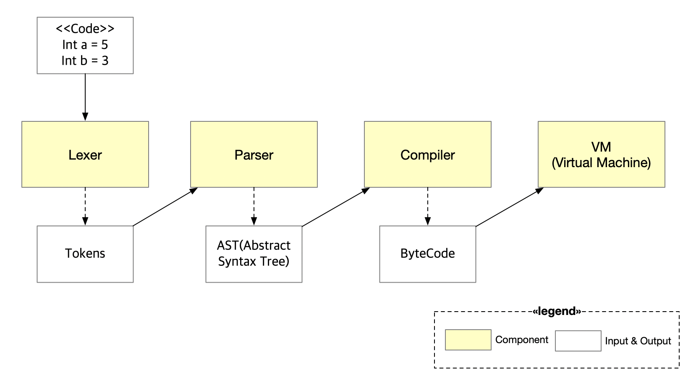

# koa 
[](https://travis-ci.org/DE-labtory/koa)
[](https://opensource.org/licenses/Apache-2.0) [](https://golang.org) [](https://coveralls.io/github/DE-labtory/koa?branch=develop)

The project is inspired by [the simplicity](https://blockstream.com/simplicity.pdf) and the [ivy-bitcoin](https://github.com/ivy-lang/ivy-bitcoin).

The koa project is to create a high-level language that has `more expressions` than the bitcoin script.


### Architecture



- Lexer
- Parser
- Compiler
- VM

### Language Specification

#### Primitive Type
- Integer

  It is expressed in `int`. Integer size is 32 bytes.

- String

  It is expressed in `string`.

- Boolean

  It is expressed in `true` or `false`.

#### Operators
- Arithmetic

  We support `+, -, *, /, %` only for integer.

- Comparison

  We support `==, !=, >, <, >=, <=` for comparsion.

- Prefix

  We support `!, -` for prefix operator.

#### Condition
It is expressed in `if(){}` or `if(){}else{}`.

#### Etc
- `return`
- `\n` : All statements should end in `\n`.
- Assign : It is expressed in `=`.

#### Example Code
 ```
 func Sig(sig string){
   string pubkey = "fvfidBGruUYC+mTw7CusaCOQbBuZBiYduFgH8hRW97KLmHn0xzB1FV++KI7syo8qXGo8Un24WP40IT78XjKO"
 
   if checkSig(pubkey, sig){
     return true
   }
   return false
 }
 ```

### Contribution
Contribution Guide
[CONTRIBUTION](CONTRIBUTING.md)

### License

Project source code files are made available under the Apache License, Version 2.0 (Apache-2.0), located in the [LICENSE](LICENSE).


### CLA Hub

To get started, <a href="https://www.clahub.com/agreements/DE-labtory/koa">sign the Contributor License Agreement</a>.
