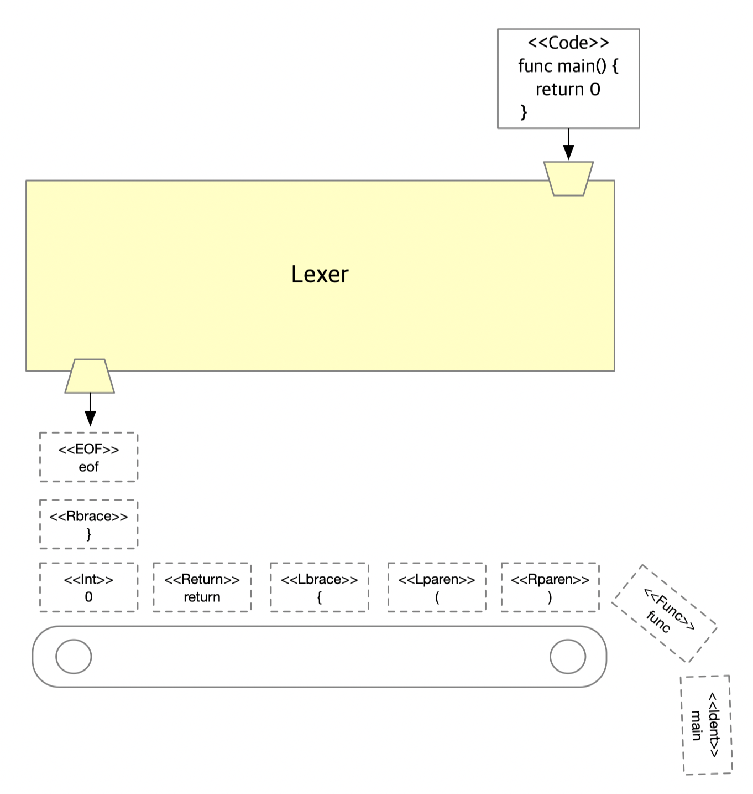
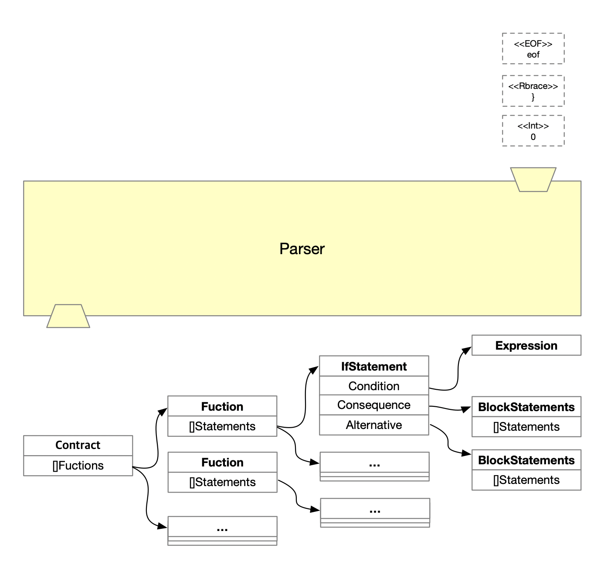
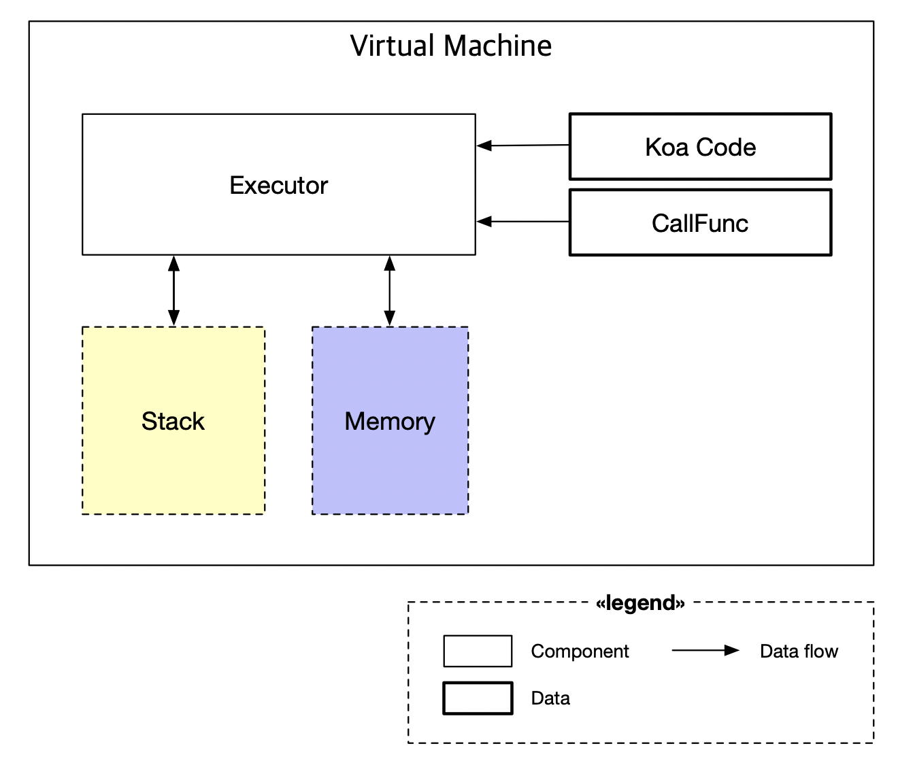
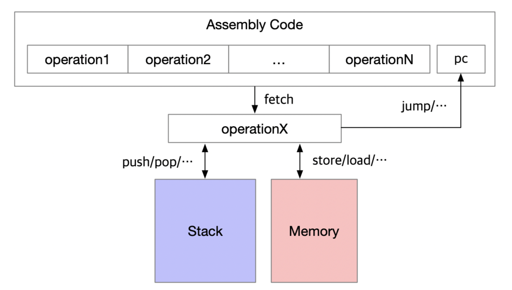

# Koa

There are two well known blockchain these days, bitcoin and ethereum. and bitcoin has bitcoin script and ethereum has solidity for programming its own smart contract. Both have pros and cons:

**In the case of bitcoin**, it has no state concept and bitcoin script is basically low-level language and has little operation so the capability what it can do is restricted. On the other hand, because of its simplicity of how it works and for bitcoin has no state, we can easily do static analysis — how fast this script will run.

**In the case of ethereum**, it has state concept and solidity designed as high-level language, the solidity developer can program more intuitively, and ethereum smart contract can do a lot of things. (and yes this is also because ethereum has state) On the other hand, as it is designed as high-level language, developer can put infinite-loop by mistake on their smart contract which won’t finish forever and this can make bad effect on network. plus as ethereum has states it is difficulty to do static analysis.

This project is inspired by [the simplicity](https://blockstream.com/simplicity.pdf) and the [ivy-bitcoin](https://github.com/ivy-lang/ivy-bitcoin). Both are aim to high-level crypto-currency language. And “Simplicity” is focuses on functional language without states, loops which enables static analysis to calculate upper bound for computational resources needed easily.

The koa project is to create a high-level language that has `more expressions` than the bitcoin script.

### Lexical analysis

The first step in the compiler is `lexical analysis` or `scanning`. Lexical analysis reads the stream of characters that make up the source code and groups these letters into a "meaningful permutation" form called lexemes. The lexical analyzer takes each lexeme as a `token` and passes it to the next step, syntax analysis(parser). (For reference, the` lexical analyzer` is simply abbreviated as `lexer`)

### Syntax analysis

#### Concept

Syntax analysis reads the stream of `token` which is generated by `lexer`, then make AST(Abstract Synstax Tree) which is passed to compiler.  Koa parser is 'Pratt parser' which is easy to make, modulable and scalable. **The main idea of 'Pratt parser' is each `token` has its own parsing functions.** (infix parsing function, prefix parsing function). In the above diagram `Program` denotes root node of AST and AST consists of slice of `Statements`.

### Virtual Machine

#### Basic Architecture

#### Execution Model

