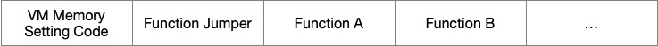
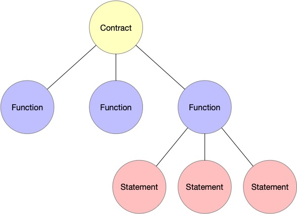
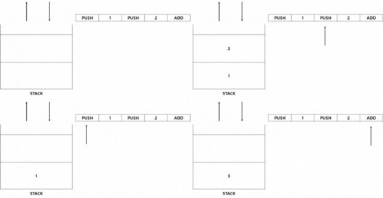
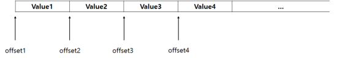

# Koa

There are two well known blockchain these days, bitcoin and ethereum. and bitcoin has bitcoin script and ethereum has solidity for programming its own smart contract. Both have pros and cons:

**In the case of bitcoin**, it has no state concept and bitcoin script is basically low-level language and has little operation so the capability what it can do is restricted. On the other hand, because of its simplicity of how it works and for bitcoin has no state, we can easily do static analysis — how fast this script will run.

**In the case of ethereum**, it has state concept and solidity designed as high-level language, the solidity developer can program more intuitively, and ethereum smart contract can do a lot of things. (and yes this is also because ethereum has state) On the other hand, as it is designed as high-level language, developer can put infinite-loop by mistake on their smart contract which won’t finish forever and this can make bad effect on network. plus as ethereum has states it is difficulty to do static analysis.


This project is inspired by [the simplicity](https://blockstream.com/simplicity.pdf) and the [ivy-bitcoin](https://github.com/ivy-lang/ivy-bitcoin). Both are aim to high-level crypto-currency language. And “Simplicity” is focuses on functional language without states, loops which enables static analysis to calculate upper bound for computational resources needed easily.

The koa project is to create a high-level language that has `more expressions` than the bitcoin script.

## Contents

* [Lexical analysis](#lexical-analysis)
* [Syntax analysis](#syntax-analysis)
* [Compile](#compile)
* [Virtual machine](#virtual-machine)


### <a name="lexical-analysis">Lexical analysis</a>

<p align="center"></p>
The first step in the compiler is `lexical analysis` or `scanning`. Lexical analysis reads the stream of characters that make up the source code and groups these letters into a "meaningful permutation" form called lexemes. The lexical analyzer takes each lexeme as a `token` and passes it to the next step, syntax analysis(parser). (For reference, the` lexical analyzer` is simply abbreviated as `lexer`)

For example, in the diagram lexer take the source code; ‘func main() { return 0 }’, then lexer reads code character by character; ‘f’, ‘u’, ‘n’, ‘c’. At the time lexer read ‘c’ lexer knows ‘fun’ + ‘c’ is meaningful word, keyword for function, then lexer cut ‘func’ characters from text(code) and make **token** for that word. Lexer keep this work until we meet `eof` . **In a nutshell lexer group characters and make tokens**.

#### Token

What is token? We can see ‘func’ word as raw data, but without processing that data, those data cannot be easily used from other components. And token is doing that job for us, token is data structure which helps data to be expressed structurally.

```go
type TokenType int

type Token struct {
   Type   TokenType
   Val    string
   Column Pos
   Line   int
}
```

That’s our token defined in project. `Type` is type for word, `Val` for word value. With this `Token` structure the other components like parser can do its job more efficiently and code will be much maintainable and scalable.

#### State and Action

Our lexer design is greatly inspired by [golang template package](https://github.com/golang/go/tree/master/src/text/template/parse) which use **state an action** concept. Actually [go-ethereum](https://github.com/ethereum/go-ethereum/blob/master/core/asm/lexer.go) also use this concept.

- **State** represents where the lexer is from the given input text and what we expect to see next.
- **Action** represents what we are going to do in current state with a piece of input

We can see lexer jobs — read character, generate token, move on to next character— as take the action with current state and move on to next state. After each action, you know where you want to be, the new state is the result of the action.

#### State function

```go
// stateFn determines how to scan the current state.
// stateFn also returns the stateFn to be scanned next after scanning the current state.
type stateFn func(*state, emitter) stateFn
```

This is our state function declaration. State function take current state and emitter, return another state function. Returned state function is based on the current state and knows what to do next. I know that state function definition is quite recursive but this helps keep things simple and clear

```go
// emitter is the interface to emit the token to the client(parser).
type emitter interface {
   emit(t Token)
}
```

And you may have curiosity, what does `emitter` do for us. You may have noticed that we know how to lexing the given inputs, but don’t know how to pass the generated tokens to the client which is probably something like parser. This is why we need `emitter` , `emitter` simply pass the token to the client using one of go features, channel. We are going to see how `emitter`works in a few seconds.

#### Run our state machine

```go
// run runs the state machine for the lexer.
func (l *Lexer) run(input string) {

   state := &state{
      input: input,
   }

   for stateFn := defaultStateFn; stateFn != nil; {
      stateFn = stateFn(state, l)
   }

   close(l.tokench)
}
```

This is our lexer `run` method which takes the input string — source code — and make `state` with our input. And in the for-loop state function call with the state as argument then return value of state function and this is the new state function. We can see lexer is passed to the state function as `emitter` , don’t be nervous we see this later how lexer implements `emitte` interface. From now, we just need to keep it mind how our state machine works:

**take the current state, do action, walk over to next state.**

What is the advantage of doing this? Well, first of all, we don’t have to check everytime what state we are in. That’s not our concern. We are always in the right place. The only thing to do in our machine is just run state function until we meet nil state function.

#### Run our machine concurrently

We don’t talk much about how to emit the token we generate to the client and I think this is the right time. The idea is we are going to run the lexer as a go routine with the client probably like parser so the two independent machines do their jobs, whenever the lexer has a new thing the client will lob it and do their own work. This mechanism can be done by go channel.

Channel is one of the greatest features in go language and yes complex, but in our lexer it is just a way to deliver data over to another program which may be running completely independent.

```go
type Lexer struct {
   tokench chan Token
}

func NewLexer(input string) *Lexer {

   l := &Lexer{
      tokench: make(chan Token, 2),
   }

   go l.run(input)
   return l
}
// emit passes an token back to the client.
func (l *Lexer) emit(t Token) {
   l.tokench <- t
}
```

That’s our lexer definition it has just token channel which are going to be used when emitting token to the client. And we can see in `NewLexer` start to run machine using go-routine.


### <a name="syntax-analysis">Syntax analysis</a>

#### Concept

Everyone who has ever programming before maybe heard about parser, if not you can guess parser do parsing at least :) Yes everyone know that. Then what is parsing exactly? [Wikipedia](https://en.wikipedia.org/wiki/Parsing) explains what is parsing quite intuitively.

> A parser is a software component that **takes input data (frequently text) and builds a data structure** *— often some kind of parse tree, abstract syntax tree or other hierarchical structure — giving a structural representation of the input, checking for correct syntax in the process.*

Parsing is process **which builds data structure with its input data.**

<p align="center"></p>

Syntax analysis reads the stream of `token` which is generated by `lexer`, then make AST(Abstract Synstax Tree) which is passed to compiler.  Koa parser is 'Pratt parser' which is easy to make, modulable and scalable. **The main idea of 'Pratt parser' is each `token` has its own parsing functions.** (infix parsing function, prefix parsing function). In the above diagram `Contract` denotes root node of AST and AST consists of slice of `FunctionLiteral`.

#### AST

Most of interpreter and compiler use AST to represent source code. But as you know, AST is data structure so there’s not one true, the concept is the same, but they differ in details for each programming language. I think that diagram is not enough so I brought real one.

```
# source code
let a = 1;
# AST
{
  "type": "Program",
  "body": [
    {
      "type": "VariableDeclaration",
      "declarations": [
        {
          "type": "VariableDeclarator",
          "id": {
            "type": "Identifier",
            "name": "a"
          },
          "init": {
            "type": "Literal",
            "value": 1,
            "raw": "1"
          }
        }
      ],
      "kind": "let"
    }
  ],
  "sourceType": "module"
}

```

Once again, javascript. There’s lots of online AST generator, so you can make it and test it on your own. As you can see some informations are omitted such as semicolon, assign operator. That’s why we call it “abstract” syntax tree, we only left what we need.

AST is tree so let’s create node which consists of our ASTree.

```go
// Node represent ast node
type Node interface {
   String() string
}
```

#### Statement vs Expression

What are these? What is difference between two? Before explaining about what is this, these are statements and expressions in our programming language.

**Statement**

- int a = 1
- return foo
- if (a == 1) {} else {}
- func foo() {}

**Expression**

- add(1, 2)
- 1 * (2 +3)
- a++

You may get the hint what is it and what is difference. **Statement** do not produce a value itself but **do something** whereas **Expression** **produce value**itself. But what exactly an expression is or a statement, depends on the programming language.

And these are our statement node and expression node.

```go
// Represent Statement
type Statement interface {
   Node
   do()
}

// Represent Expression
type Expression interface {
   Node
   produce()
}
```

#### Contract

We’ve done to create our nodes of tree. Before we move on to next level, I’ll show you how our Smart Contract looks like.

```
contract {
    func sendMoneyTo(id string) {
        // logic here
    }
    func receiveMoney(id string) {
        // logic here
    }
    ...
}
```

As you can see, our contract starts with `contract` keyword and inside the block, there are set of functions client can use.

I show you how our Smart Contract looks like first because I hope this can help you to understand our root node of AST; Contract.

```go
// Represent Contract.
// Contract consists of multiple functions.
type Contract struct {
   Functions []*FunctionLiteral
}
func (c *Contract) do() {}
func (c *Contract) String() string { /* return strings */ }
```

Quite intuitive, isn’t it? `Contract` implements Statement and `Contract` has `Functions` which represents functions in contract like `sendMoneyTo` and `receiveMoney`. And this is our `FunctionLiteral`

```go
// FunctionLiteral represents function definition
// e.g. func foo(int a) string { ... }
type FunctionLiteral struct {
   Name       *Identifier
   Parameters []*ParameterLiteral
   Body       *BlockStatement
   ReturnType DataStructure
}
func (fl *FunctionLiteral) do() {}
func (fl *FunctionLiteral) String() string { /* return strings */ }
```

`Name` represent function name, `Parameters` for function parameters, `Body`for function body which contains function logic, `ReturnType` for return type fo function, quite straightforward.

#### Parser

When designing a parser we discussed that **it would be better if parser don’t keep the pointer of tokens**. Because I thought it is not the responsibility of parser, just reading the token from something and parsing it is the only thing parser should do.

##### TokenBuffer

So created ‘TokenBuffer’ concept. TokenBuffer keeps tokens pointer and client can read or peek the token from it. With TokenBuffer we can make our parser much compact, we see this later.

```go
// TokenBuffer provide tokenized token, we can read from this buffer
// or just peek the token
type TokenBuffer interface {
   // Read retrieve token from buffer. and change the
   // buffer states
   Read() Token

   // Peek take token as many as n from buffer but not change the
   // buffer states
   Peek(n peekNumber) Token
}
```

And this is our `TokenBuffer` interface. It has two methods `Read()` and `Peek(n peekNumber)` , our parser will use it to retrieve tokens to parsing.

After we create `TokenBuffer` and decided to pass this `TokenBuffer` to parsing functions as parameter, there is no need to create parser `struct` and there is one good advantage we could **test each parsing function easily**. If we make parsing function as method, every time we test the methods we should make parser structure first, and check whether parser states is not impact on its method logic. Yes, function is stateless only parameters can change its behavior, same inputs same results.

```go
func Parse(buf TokenBuffer) (*ast.Contract, error) {
   contract := &ast.Contract{}
   contract.Functions = []*ast.FunctionLiteral{}
   ...
   for buf.Peek(CURRENT).Type == Function {
      fn, err := parseFunctionLiteral(buf)
      if err != nil {
         return nil, err
      }

      contract.Functions = append(contract.Functions, fn)
   }
   ...
   return contract, nil
}
```

This is the entry point to parsing function. `Parse` takes `TokenBuffer` as we talk before and in the for loop parsing Smart Contract’s functions.

#### Pratt Parser

One of the big problems when implementing parser is to decide how to **parse expression**. And we can solve this problem in a [Pratt Parser](https://en.wikipedia.org/wiki/Pratt_parser) way. It was first described by [Vaughan Pratt](https://en.wikipedia.org/wiki/Vaughan_Pratt) in the 1973 paper “Top down operator precedence”.

Then what is Pratt Parser? why we decided to use it? One of the key features of this parsing is **for each token we define several parsing functions**. (there’s one more, I will show you in a few seconds)

Advantage of this parsing is **easy to make, easy to understand, easy to scale**which quite fits to our needs.

In our parser using Pratt Parsing way, we should define at most two parsing function for each token type. One is **prefix parsing function** for parsing token as prefix expression, the other is **infix parsing function** for parsing token as infix expression.

```go
type (
   prefixParseFn func(TokenBuffer) (ast.Expression, error)
   infixParseFn  func(TokenBuffer, ast.Expression) (ast.Expression, error)
)

var prefixParseFnMap = map[TokenType]prefixParseFn{}
var infixParseFnMap = map[TokenType]infixParseFn{}
```

These are declaration of type of prefix/infix parsing function and maps which store parsing functions for each token type.

```go
func initParseFnMap() {
   prefixParseFnMap[Int] = parseIntegerLiteral
   prefixParseFnMap[Minus] = parsePrefixExpression
   ...
   infixParseFnMap[Minus] = parseInfixExpression
   ...
}
```

In the case of ‘minus’, ‘minus’ can be used as infix or prefix (we saw it as example above) so define `parsePrefixExpression` in the `prefixParseFnMap`and `parseInfixExpresion` in the `infixParseFnMap`

```go
type precedence int

const (
   _ precedence = iota
   LOWEST
   ...
   SUM         // +
   PRODUCT     // *
   ...
   CALL        // function(X)
)

var precedenceMap = map[TokenType]precedence{
   Plus:     SUM,
   ...

   Asterisk: PRODUCT,
   ...
   Lparen:   CALL,
}
```

And as I mentioned before, each token type has its own precedence which tell us which token type should be grouped first. In the code above, we can see that `Asterisk` has higher precedence than the `Plus` and `Lparen` has higher precedence than `Asterisk`.

##### parseExpression function example

What we are going to parse is this.

```
- 1 + 2 * 3 == after parsing ==> ((-1) + (2 * 3))
```

And you may remember that parser fed tokens from TokenBuffer. So we can imagine that parser will receive tokens like this.

```
----------------------TokenBuffer-------------------------
    parser   <- |  -  |  1  |  +  |  2  |  *  |  3  |  ;  |
----------------------------------------------------------
```

Then… Let’s start parsing expression!

```go
----------------------TokenBuffer-------------------------
    parser   <- |  -  |  1  |  +  |  2  |  *  |  3  |  ;  |
----------------------------------------------------------
func parseExpression(buf TokenBuffer, pre precedence) (ast.Expression, error) {
   // pre: LOWEST
   exp, err := makePrefixExpression(buf) <-- done prefix parsing#1
   exp, err = makeInfixExpression(buf, exp, pre)

   return exp, nil
}
```

Enter into `makePrefixExpression`, later `done prefix parsing#1` will be used as mark.

```go
----------------------TokenBuffer-------------------------
    parser   <- |  -  |  1  |  +  |  2  |  *  |  3  |  ;  |
----------------------------------------------------------
func makePrefixExpression(buf TokenBuffer) (ast.Expression, error) {
   curTok := buf.Peek(CURRENT) <-- [ - ]
   fn := prefixParseFnMap[curTok.Type] <-- fn: parsePrefixExpression
   exp, err := fn(buf)
   return exp, nil
}
```

Peeked token is ‘minus’ and its prefix parse function is `parsePrefixExpression`I’ll not show you the whole function, but what we need.

```go
----------------------TokenBuffer-------------------------
    parser   <- |  1  |  +  |  2  |  *  |  3  |  ;  |
----------------------------------------------------------
func parsePrefixExpression(buf TokenBuffer) (ast.Expression, error) {
   tok := buf.Read()  <-- [ - ]
   op := operatorMap[tok.Type]
   right, err := parseExpression(buf, PREFIX) <-- recursive#1
   ...
}
```

We can see that Pratt Parser [recursive descent](https://en.wikipedia.org/wiki/Recursive_descent_parser). Call `parseExpression` again.

```go
----------------------TokenBuffer-------------------------
    parser   <- |  1  |  +  |  2  |  *  |  3  |  ;  |
----------------------------------------------------------
func makePrefixExpression(buf TokenBuffer) (ast.Expression, error) {
   curTok := buf.Peek(CURRENT) <-- [ 1 ]
   fn := prefixParseFnMap[curTok.Type] <-- fn: parseIntegerLiteral
   exp, err := fn(buf)
   return exp, nil
}
```

Peeked token is ‘integer’ and its prefix parse function is `parseIntegerExpression`

```go
----------------------TokenBuffer-------------------------
    parser   <- |  +  |  2  |  *  |  3  |  ;  |
----------------------------------------------------------
func parseIntegerLiteral(buf TokenBuffer) (ast.Expression, error) {
   token := buf.Read() <-- [ 1 ]
   value, err := strconv.ParseInt(token.Val, 0, 64)
   lit := &ast.IntegerLiteral{Value: value}
   return lit, nil
}
```

Then we return twice, then our pc is now on the `recursive#1` point, and return once again. And now we built `(-1)` expression! and we are on the `done prefix parsing#1`, move on to `makeInfixExpression`.

```go
----------------------TokenBuffer-------------------------
    parser   <- |  +  |  2  |  *  |  3  |  ;  |
----------------------------------------------------------
func makeInfixExpression(buf TokenBuffer, exp ast.Expression, pre precedence) (ast.Expression, error) {
expression := exp
   for !curTokenIs(buf, Semicolon) && pre < curPrecedence(buf) {
      token := buf.Peek(CURRENT) <-- [ + ]
      fn := infixParseFnMap[token.Type] <-- parseInfixExpression#1

      expression, err = fn(buf, expression)
   }
   return expression, nil
}
```

As ‘plus’ is not semicolon and has higher precedence than `LOWEST`, so enter the loop, also ‘plus’ has `parseInfixExpression` infix parsing function.

```go
----------------------TokenBuffer-------------------------
    parser   <- |  2  |  *  |  3  |  ;  |
----------------------------------------------------------
func parseInfixExpression(buf TokenBuffer, left ast.Expression) (ast.Expression, error) {
   curTok := buf.Read() <-- [ + ]

   expression := &ast.InfixExpression{
      Left:     left, <-- [ (-1) ]
      Operator: operatorMap[curTok.Type], <-- [ + ]
   }

   precedence := precedenceMap[curTok.Type] <-- [ SUM ]
   expression.Right, err = parseExpression(buf, precedence) <-- recursive#2

   return expression, nil
}
```

Recursive again, but at this time execute `parseExpression` with precedence `SUM`

```go
----------------------TokenBuffer-------------------------
    parser   <- |  2  |  *  |  3  |  ;  |
----------------------------------------------------------
func makePrefixExpression(buf TokenBuffer) (ast.Expression, error) {
   curTok := buf.Peek(CURRENT) <-- [ 2 ]
   fn := prefixParseFnMap[curTok.Type] <-- fn: parseIntegerLiteral
   exp, err := fn(buf) <-- IntegerLiteral{2}
   return exp, nil
}
----------------------TokenBuffer-------------------------
    parser   <- |  *  |  3  |  ;  |
----------------------------------------------------------
func parseIntegerLiteral(buf TokenBuffer) (ast.Expression, error) {
   token := buf.Read() <-- [ 2 ]
   value, err := strconv.ParseInt(token.Val, 0, 64)
   lit := &ast.IntegerLiteral{Value: value}
   return lit, nil
}
```

At this point we’ve created `IntegerLiteral{Value:2}` and assigned it to `exp`, then enter to `makeInfixExpression` with precedence `SUM`!

```go
----------------------TokenBuffer-------------------------
    parser   <- |  *  |  3  |  ;  |
----------------------------------------------------------
func makeInfixExpression(buf TokenBuffer, exp ast.Expression, pre precedence) (ast.Expression, error) {
expression := exp <-- IntegerLiteral
   for !curTokenIs(buf, Semicolon) && pre < curPrecedence(buf) {
      /* we get into the loop! */
      token := buf.Peek(CURRENT) <-- [ * ]
      fn := infixParseFnMap[token.Type] <-- parseInfixExpression#2

      expression, err = fn(buf, expression)
   }
   return expression, nil
}
```

Here is the KEY PART! **Because we compare ‘plus’ precedence which is**`**SUM**` **with ‘asterisk’ precedence which is** `**PRODUCT**`**, we get into the loop!**

```go
----------------------TokenBuffer-------------------------
    parser   <- |  3  |  ;  |
----------------------------------------------------------
func parseInfixExpression(buf TokenBuffer, left ast.Expression) (ast.Expression, error) {
   curTok := buf.Read() <-- [ * ]

   expression := &ast.InfixExpression{
      Left:     left, <-- [ 2 ]
      Operator: operatorMap[curTok.Type], <-- [ * ]
   }

   precedence := precedenceMap[curTok.Type] <-- [ PRODUCT ]
   expression.Right, err = parseExpression(buf, precedence) <-- recursive#3

   return expression, nil
}
```

I would skip a little bit, in `recursive#3`, create `IntegerLiteral{Value: 3}` and this is assigned to `expression.Right`. Now we’ve done to group `(2 * 3)`, before we group `1 + 2`! This is because `PRODUCT` have higher precedence than `SUM` so that we can get into for-loop and grouped.

```go
----------------------TokenBuffer-------------------------
    parser   <- |  ;  |
----------------------------------------------------------
func makeInfixExpression(buf TokenBuffer, exp ast.Expression, pre precedence) (ast.Expression, error) {
   expression := exp <-- IntegerLiteral
   for !curTokenIs(buf, Semicolon) && pre < curPrecedence(buf) { <-- because of    semicolon, we can't get into this loop
      token := buf.Peek(CURRENT) <-- was [ * ]
      fn := infixParseFnMap[token.Type] <-- parseInfixExpression#2

      expression, err = fn(buf, expression)
   }
   return expression, nil
}
```

After make `(2 * 3)` expression, we return to `parseInfixExpession#2`, and we left semicolon in the TokenBuffer, so that we return from `makeInfixExpression`

```go
----------------------TokenBuffer-------------------------
    parser   <- |  ;  |
----------------------------------------------------------
func makeInfixExpression(buf TokenBuffer, exp ast.Expression, pre precedence) (ast.Expression, error) {
   expression := exp
   for !curTokenIs(buf, Semicolon) && pre < curPrecedence(buf) {
      token := buf.Peek(CURRENT) <-- was [ + ]
      fn := infixParseFnMap[token.Type] <-- parseInfixExpression#1

      expression, err = fn(buf, expression)
   }
   return expression, nil
}
```

Then at the `recursive#2` we can see that `(2 * 3)` expression becomes right expression of `(-1) +`, then return to `parseInfixExpression#1`. Finally we made `((-1) + (2 * 3))`

Through this example we can feel that Pratt Parser is recursive — recursively call `parseExpression` and make leaf node. And every time we get into for loop in `makeInfixExpression` our AST is getting deeper.


### <a name="compile">Compile</a>

Compiling produces a code by assembling information collected from other sources. Koa compiler **reads the `AST` made by `parser` and generates a code called `bytecode`.** `Bytecode` is a kind of assemble codes. This has an information how to execute a program.

#### Bytecode

`Bytecode` is an output generated by `compiler`. Through `vm` executing this code, we can get result of the source code.

```go
type Bytecode struct {
   RawByte []byte
   AsmCode []string
   Abi     abi.Abi
}
```

This is our `Bytecode` structure. It has 3 fields. `RawByte` is the program to execute. And `RawByte` consists of hexadecimal code. `AsmCode` is a collection of assemble codes which is more readable to human than bytes. `Abi` is an interface needed to user for calling the functions.

<p align="center"></p>

The raw bytecode is structed like above. `VM Memory Setting code` sets memory size of the `VM`. `Function Jumper` could find the position of each function. And, the functions of contract would be followed by the `Function Jumper`. Each function bytecode has the `function selector`, parameters, and logic.

[Function Jumper](#function-jumper) and [Function Selector](#function-selector) will be explained later.

#### AST & Compile

<p align="center"></p>

The root of AST is a `contract`. `Contract` has some `functions`. And, a `function` has some `statements`.

`CompileContract()` function compiles the contract. It compiles every function and adds `VM memory setting code` and `jump selector`. `compileFunction()` function compiles a function in the contract. It is called recursively and compiles each function. `compileStatement()` function compiles a statement in the function. It is called recursively and compiles each statement.

#### <a name="function-selector">Function Selector</a>

Each function should have identifiers to distinguish each other. The `function selector` is an identifier to distinguish each function. It is generated by Keccak algorithm (SHA-3). This algorithm generates a bytes with function name and parameter type. And the first 4 bytes of those bytes are the `function selector`. For example, the `function selector` of `function foo(int a) bool` is `0x4ff9f498`. The keccak algorithm receives `"foo(int)"` and generates some bytes. The first 4 bytes of those are `0x4ff9f598` and this is the `function selector`.

#### <a name="function-jumper">Function Jumper</a>

The `function jumper` includes a logic to find a function to call. If an user calls `function a()`, program counter points `function jumper`. Because of the static location of `function jumper`, the program could know the position of `function jumper`. This finds the `function selector` corresponding with `function a()`. Then, returns the bytes of `function a()`'s `function selector`. Finally, `VM` could know the position `function a()` and execute it.

```go
switch selector {
     case 0x4ff9f498:
           pc = 120
     case 0x88t3odko:
           pc = 1550
}
```

For example, suppose that we need to call `function foo(int a) bool`. Fisrt, `program counter` moves to the `function jumper`. And, comparing `function selecetor` with `calldata`, finds out the `pc` position of `function foo(int a) bool`. Then, moves to where the `pc` is 120. Finally, `vm` can executes `function foo`.

### <a name="virtual-machine">Virtual Machine</a>

VM change the `Bytecode` created by the `Compiler` to the KOA-compliant assemble code and executes it. It then interprets Bytecode with the execution information of the function in `CallFunc` contract and proceeds with operation using `Stack` and `Memory`.

#### Basic Architecture

<p align="center"></p>

#### Stack

Stack can accumulate a total of 1024 items, and each item can store 64bits of data. In the stack, the data is accumulated, and when the operator is encountered, the operation is done. The following example changes the human-readable code to `Bytecode`, `Assemble code`.

##### code

>1 + 2

##### bytecode

>0x20 0x01 0x20 0x01 0x01

##### assemble

>PUSH 1 PUSH 2 ADD

The above code works like the image below on the stack.

<p align="center"></p>

As you can see in the above process, the stack is not a space for storing data but a space for operations. `Memory` and `CallFunc` are the space for storing data.

#### Memory

`Memory` is responsible for managing variables and return values. When a programmer assigns a value to a variable, the value is stored in memory, and the return value is also stored in memory. And when you want to use the saved variable, it will be taken out of memory.

<p align="center"></p>

The above image shows the structure of the memory. Unlike Stack, memory is not limited by size. That's why you can store dynamic type values such as strings and arrays.

#### CallFunc

`CallFunc` is used when a programmer creates a contract and then calls a function inside a contract. To call a specific function, you need to know the name of the function and the parameter information of the function.

The name of the function is retrieved by the [`Function Selector`](#function-selector), and the parameter information is defined and stored by the [`ABI encoding`](#abi-encoding).

#### ABI

ABI is Application Binary Interface which can interact user with KOA.  
The type supported by 0.1.0 version is `string`, `int`, `bool`

##### Format

```json
[
	{
		"name" : "foo",
		"arguments" : [
			{
				"name" : "first",
				"type" : "int256"
			},
			{
				"name" : "second",
				"type" : "string"
			},
			{
				"name" : "third",
				"type" : "byte[]"
			}
		],
		"output" : {
			"name" : "returnValue",
			"type" : "int256"
		}
	},
	{
		"name" : "var",
		"arguments" : [
			{
				"name" : "first",
				"type" : "int256"
			},
			{
				"name" : "second",
				"type" : "string"
			},
			{
				"name" : "third",
				"type" : "byte[]"
			}
		],
		"output" : {
			"name" : "returnValue",
			"type" : "int256"
		}
	}
]
```  
##### Encoding <a id="abi-encoding"/>

ABI Encoding is used when user call function.

function parameters according to abi specification are encoded as byte. And bytes has a pointer, size, value.

Pointer : 4bytes
Size : 4bytes
Value : The static type is 8bytes, dynamic type is sized according to the size.

Example)
function foo(int, string, int)
parameters : (50, "HelloKOA", 256)

Pointer 1 -> 0x00 : 0000000C  
Pointer 2 -> 0x04 : 00000011  
Pointer 3 -> 0x08 : 0000001D  
Size 1 &nbsp;&nbsp;&nbsp;&nbsp;-> 0x0C : 00000001  
Value 1 &nbsp; -> 0x10 : 32  
Size 2 &nbsp;&nbsp;&nbsp;&nbsp;-> 0x11 : 00000008  
Value 2 &nbsp; -> 0x15 : 48656c6c6f4b4f41  
Size 3 &nbsp;&nbsp;&nbsp; -> 0x1D: 00000002  
Value 3 &nbsp; -> 0x21 : 0100  

#### Execution Model

<p align="center"></p>
